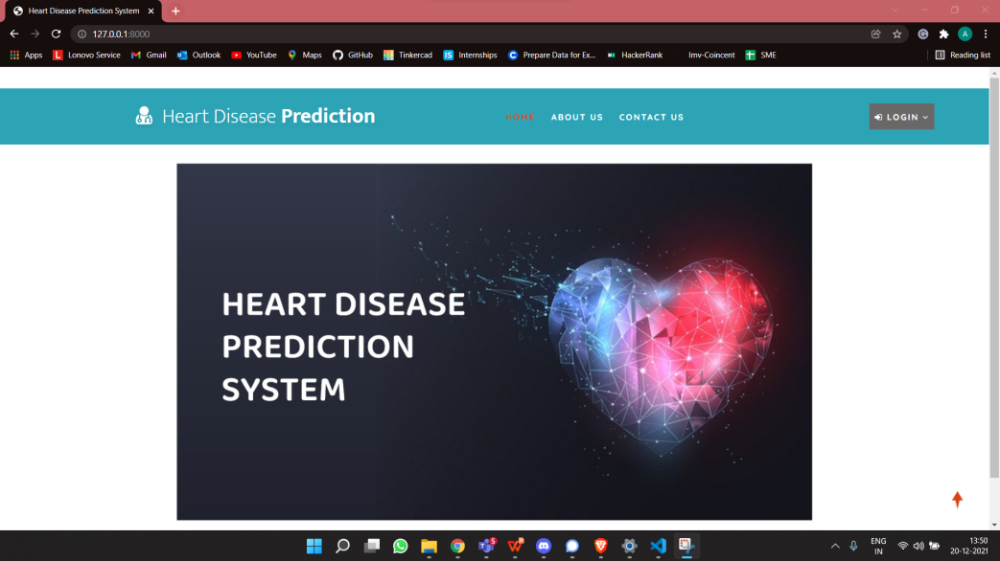
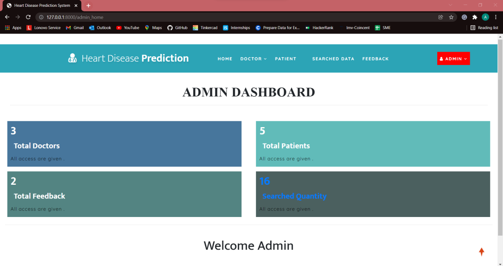
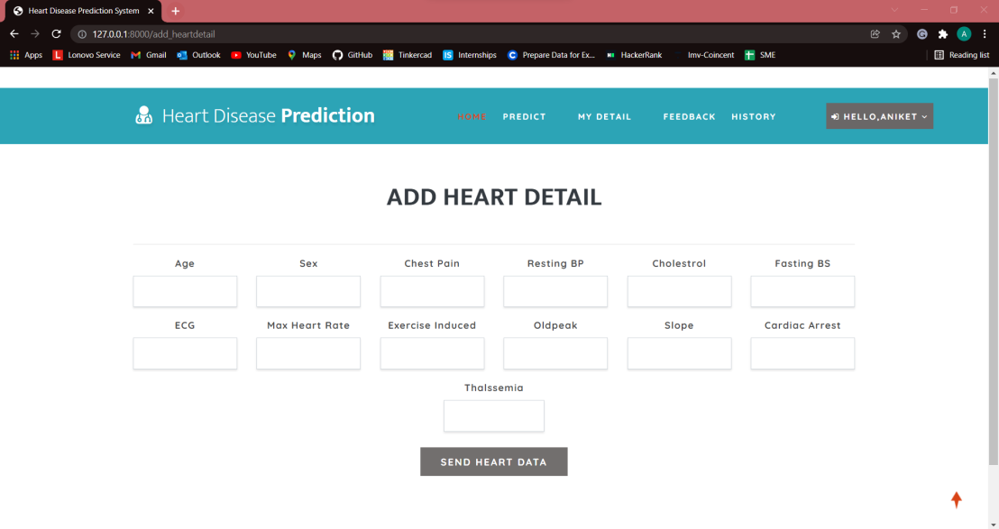

# Heart Disease Prediction System 


## Overview
A web-based Heart Disease Prediction System that uses Machine Learning to predict the likelihood of heart disease based on various medical parameters. The system helps in early detection of heart disease by analyzing patient data and providing predictions using advanced ML algorithms.

## Features
- 🔐 User Authentication (Patient, Doctor, Admin)
- 📊 Heart Disease Prediction using ML
- 👨‍⚕️ Doctor Search and Management
- 📝 Patient Records Management
- 📈 Historical Data Analysis
- 💬 Feedback System
- 🔔 Notification System

## Tech Stack
### Frontend
- 
- 
- 
- 

### Backend
- 
- 

### Machine Learning
- 
- 
- 

### Database
- 

## Installation

1. Clone the repository
```bash
git clone https://github.com/ankit-kumarz/Heart-Disease-Prediction-System
```

2. Navigate to project directory
```bash
cd Heart-Disease-Prediction-System
```

<<<<<<< HEAD
3. Create and activate virtual environment
=======
3. Create and activate virtual environment  
>>>>>>> 9865e6812bde234e4879e40c3f30e8fe3f67e9e3
```bash
python -m venv venv
source venv/bin/activate  # On Windows: venv\Scripts\activate
```

4. Install dependencies
```bash
pip install -r requirements.txt
```

5. Run migrations
```bash
python manage.py migrate
```

<<<<<<< HEAD
6. Start the development server
=======
6. Start the development server 
>>>>>>> 9865e6812bde234e4879e40c3f30e8fe3f67e9e3
```bash
python manage.py runserver
```

## Machine Learning Model
The system uses Gradient Boosting Classifier for heart disease prediction. The model is trained on various medical parameters including:
- Age
- Sex
- Chest Pain Type
- Blood Pressure
- Cholesterol
- Blood Sugar
- ECG Results
- Heart Rate
- Exercise Induced Angina
- ST Depression
- Slope
- Number of Major Vessels 
- Thalassemia

## Dataset
The model is trained on the Heart Disease dataset. You can find the dataset in the `Machine_Learning/heart.csv` file.

<<<<<<< HEAD
## Screenshots
=======
## Screenshots:
>>>>>>> 9865e6812bde234e4879e40c3f30e8fe3f67e9e3
### Welcome Page


### Admin Dashboard


### Heart Details Input


## Documentation
For detailed project documentation and report, please refer to the project report in the `REPORT` directory.

## Demo Video
<<<<<<< HEAD
Watch the demo video in the project documentation.
=======
Watch the demo video in the project documentation. 
>>>>>>> 9865e6812bde234e4879e40c3f30e8fe3f67e9e3

## Contributing
Contributions are welcome! Please feel free to submit a Pull Request.

## License
This project is licensed under the MIT License - see the LICENSE file for details.

## Author
<<<<<<< HEAD
- **Ankit Kumar** - [GitHub Profile](https://github.com/ankit-kumarz)


## Acknowledgments
- Thanks to all contributors who have helped in developing this project
- Special thanks to the open-source community for their valuable tools and libraries
<<<<<<< HEAD

=======

